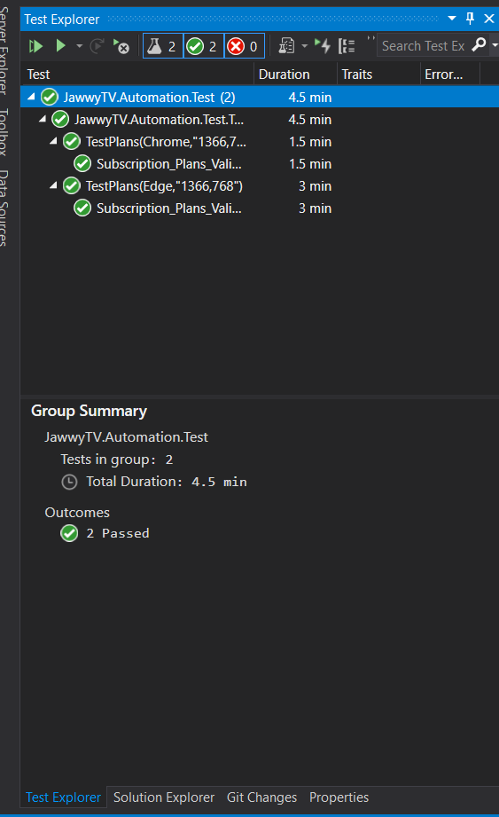

# JawwyTV_Selenium_Automation
DEMOBLAZE API Automation Framework
#

## SETUP
### Environment Setup
- .Net Framework 4.7.2

### Installing nuget packages
- Open cmd, navigate to project directory
- install packages for both projects: Automation, Automation.Test
```commandline
 nuget install packages.config
```
### Running Tests
Best to Run through VS Test Explorer
# 

#
#
## Project Structure
### JawwyTV.Automation
 - **Browser**:
   - Driver: include all related driver setup methods including returning a new instane of the driver and creating drivers of different type for cross browser testing
   - Resolutions: class that include common resolutions to be used in testing can be refactored later to be a general class that holds generic static data
   - Extension: have methods that extend driver or elements so we can customize our own implementation and resuse it throughout the framework
- **Pages**
  - Following POM, all related elements have been combined in a page class
    * Page class consists of : 
      * Elements -> elements that we need to interact with in our test.
      * Methods -> methods to interact with page elements when directrly testing those elements
      * Actions -> combine multiple methods along with asserting the results of the action these action methods are useful when are focusing on testing another page functionality
    * DashboardPage: As the Landing page includes many different feature so this class helps to direct towards page/feature under test
    * HeaderPage: Includes all buttons/features in the header like language, perference and sign in
    * PlansPage : Includes all subscription plans related elements
- **utils**:
  * Contains any classes that needed for setting up the framework
    * HelperMethods : Includes generic helper methods like setting up the logger and deserialise any json file
    * Reporter : sets up the reporter to generat html report
    * Routes: Includes all app routes

#
### JawwyTV.Automation.Test
  - **Models**: Includes any json models that are used for data driven testing
  - **Tests**: Includes tests
  - **TestData**: Includes data that are used for testing usually in json format
- **utils**:
  * Contains any classes that needed for setting up the framework
    * DataHelper : Includes methods that returns lists that are used in data driven tests
    * TestBase :  TestFixture that includes setup(onetime or before each test) and cleanup methods that should be executed after the test for:
      * Setup and teardown Driver
      * setup and close logger
      * setup and close reporter
- **Reports and Logs** : Includs generated reports and logs, should be in .gitignore but I've included them as part of task solution
